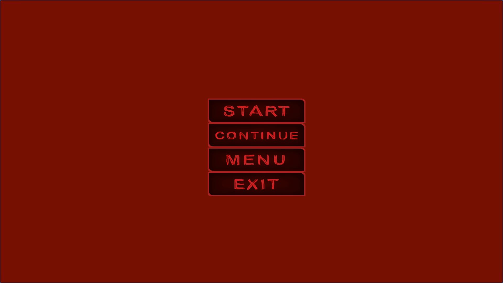
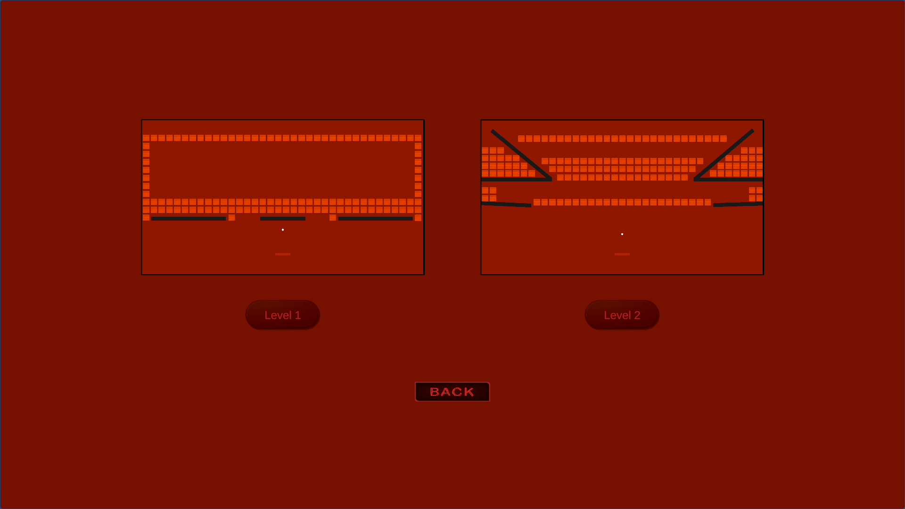
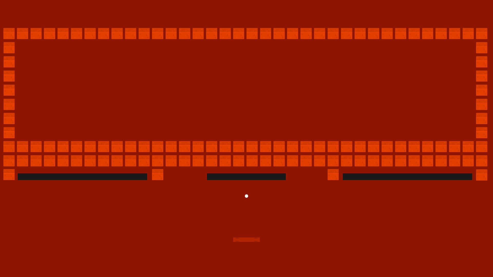
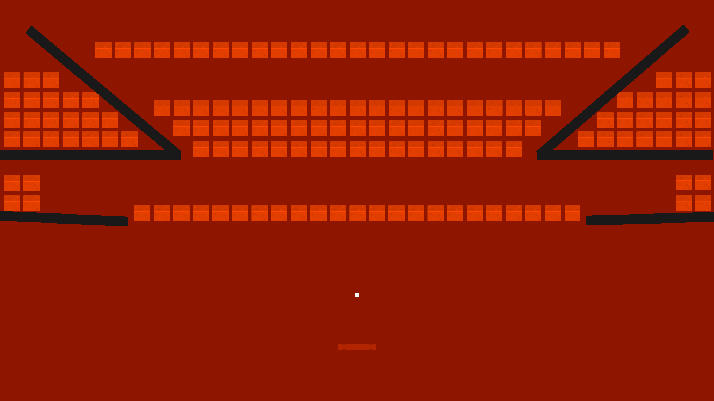
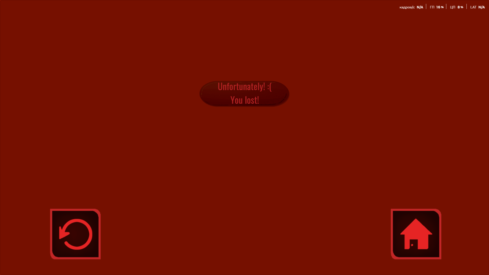
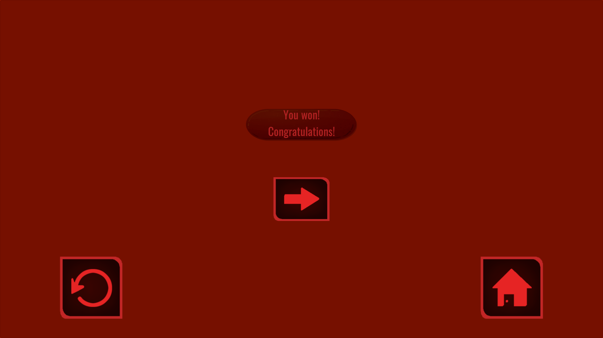
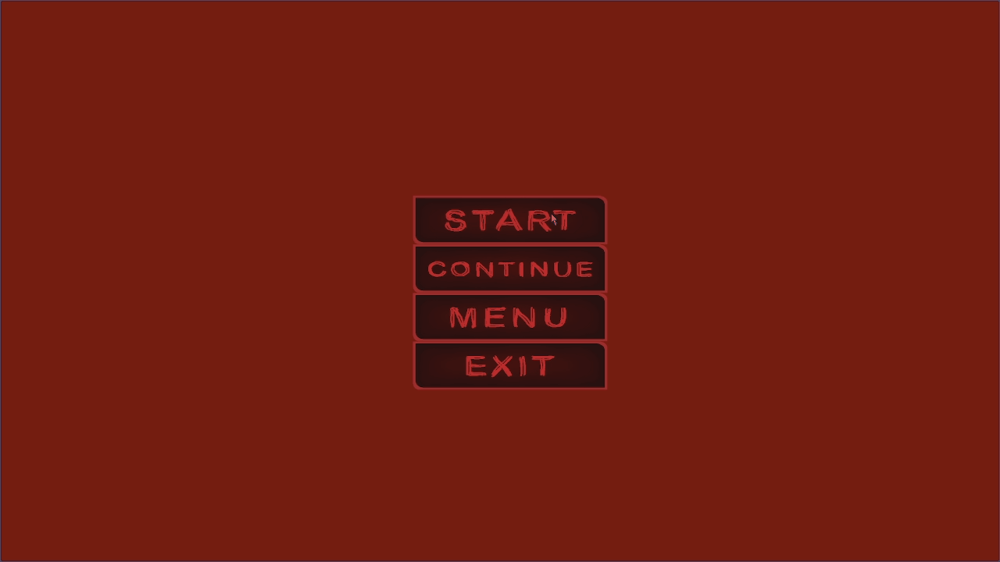
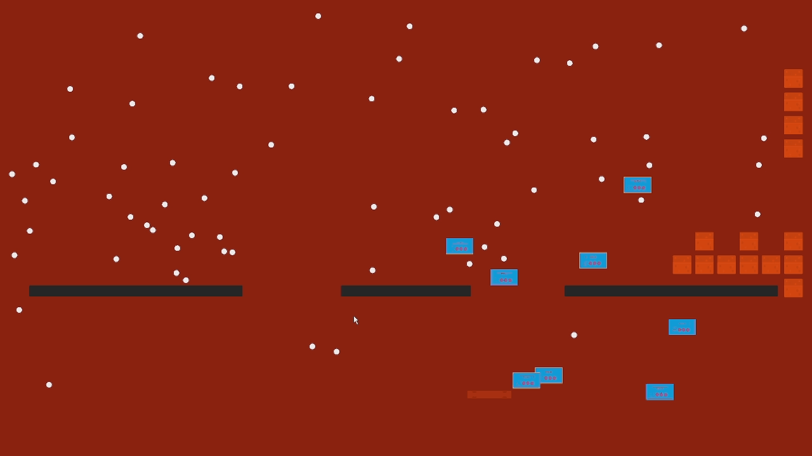

# Breakout Clone (Project 2)

A classic **Breakout-style arcade game** made with Unity and C#.  
This is my second completed game project. I got a lot of skills from this project, I did mechanichs that I didn't do in the previous project, studied physics.

---

##  Gameplay

- Control the paddle to bounce the ball.
- Destroy all blocks to win the level.
- Collect bonus items that randomly spawn from destroyed blocks.

---

##  Features
- Classic arcade mechanics (paddle, ball, blocks).
- Bonus items with different effects.
- Simple and clear UI.
- Sound effects and background music.
- Fully playable build.

---

##  How to Play
1. Download the latest release from the **Releases** page.  
2. Run the `.exe` (Windows build).  
   *(or open the project in Unity Editor and run the main scene)*

---

##  Built With
- Unity 6.0 LTS
- C#

---

##  Project Status
✅ Finished — this is a complete and playable version.  

---

##  Author
Made by [mart3r2ok](https://github.com/mart3r2ok).
